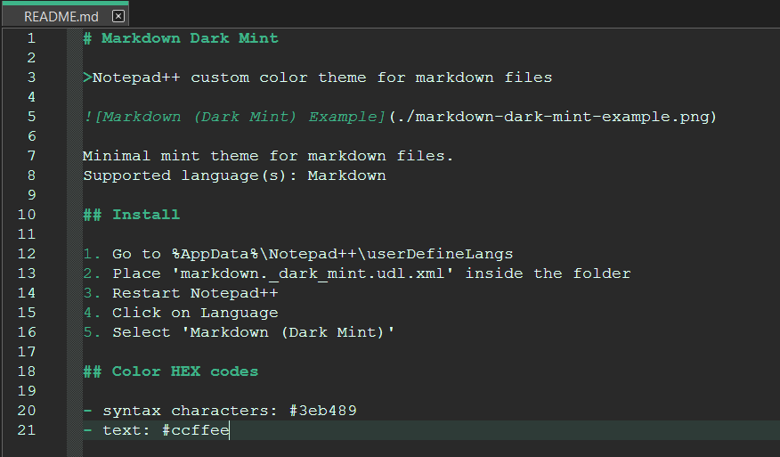

# Markdown Dark Mint

>Notepad++ custom color theme for markdown files

Minimal mint theme for markdown files.
Supported language(s): Markdown

## Install

1. Go to %AppData%\Notepad++\userDefineLangs
2. Place 'markdown._dark_mint.udl.xml' inside the folder
3. Restart Notepad++
4. Click on Language
5. Select 'Markdown (Dark Mint)'

## Color HEX codes

- syntax characters: #3eb489
- text: #ccffee